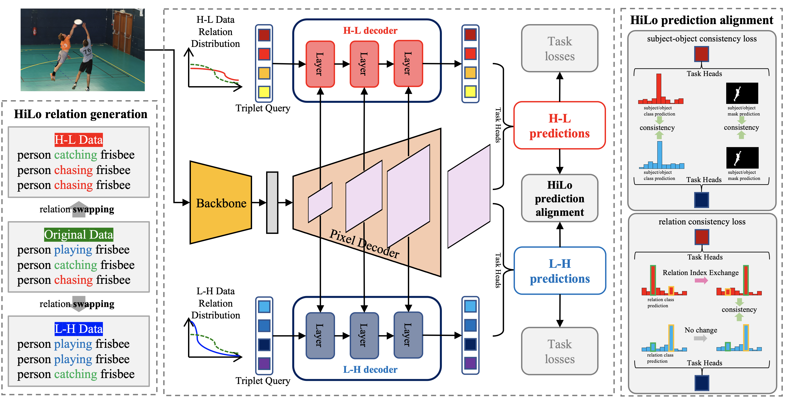
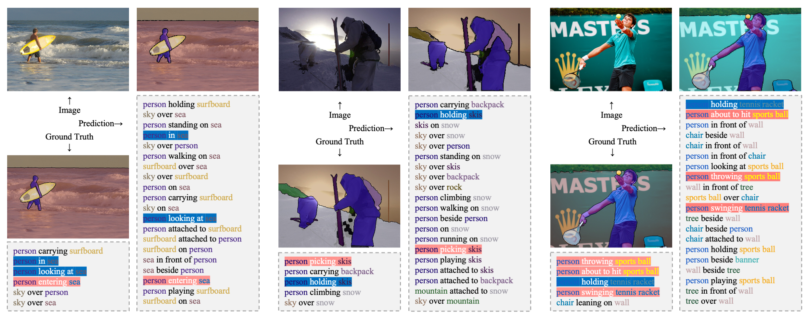

# HiLo: Exploiting High Low Frequency Relations for Unbiased Panoptic Scene Graph Generation

[](https://paperswithcode.com/sota/panoptic-scene-graph-generation-on-psg?p=hilo-exploiting-high-low-frequency-relations)

ICCV 2023, official code implementation, [arXiv](https://arxiv.org/abs/2303.15994)

## Abstract
Panoptic Scene Graph generation (PSG) is a recently proposed task in image scene understanding that aims to segment the image and extract triplets of subjects, objects and their relations to build a scene graph.
This task is particularly challenging for two reasons. 
First, it suffers from a long-tail problem in its relation categories, making naive biased methods more inclined to high-frequency relations.
Existing unbiased methods tackle the long-tail problem by data/loss rebalancing to favor low-frequency relations.
Second, a subject-object pair can have two or more semantically overlapping relations.
While existing methods favor one over the other, our proposed HiLo framework lets different network branches specialize on low and high frequency relations, enforce their consistency and fuse the results.
To the best of our knowledge we are the first to propose an explicitly unbiased PSG method.
In extensive experiments we show that our HiLo framework achieves state-of-the-art results on the PSG task. We also apply our method to the Scene Graph Generation task that predicts boxes instead of masks and see improvements over all baseline methods.

## Method

An overview of our HiLo framework with HiLo baseline.
a) HiLo relation swapping module swaps the multiple relations in the subject-object pair to obtain H-L Data and L-H Data respectively.
b) Input data into our HiLo framework with HiLo baseline model, there are two branches, namely H-L decoder and L-H decoder, which learn H-L Data and L-H Data respectively.
c) In addition to task losses for PSG, we propose HiLo prediction alignment, which includes subject-object consistency loss and relation consistency loss, so that the parallel branch can be better optimized.

## Results

Comparison between our HiLo and other methods on the PSG dataset. Our method shows superior performance compared to all previous methods.

## Visualization

Visualization of panoptic segmentations and the top 20 predicted triplets compared with ground truth. The upper left is the original image, the lower left is the ground truth and on the right are the predictions. The highlighted triplets represent the subject-object pairs with multiple relations, where the blue highlights represent the high frequency relations and the red highlights represents the low frequency relations. The visualization results show that our method can predict both high frequency and low frequency relations.

## Preparation

Dev environment:
```
git clone https://github.com/franciszzj/HiLo.git
cd HiLo
conda create --name hilo --file spec-file.txt
conda activate hilo
```
Please install ```mmcv==v1.7.0``` and ```mmdet==v2.25.2```.

Pretrained models are directly converted from [Mask2Former](https://github.com/open-mmlab/mmdetection/tree/main/configs/mask2former) using [this code](./tools/change_model.py).
```.bash
python tools/change_model.py path/to/pretrained/model
```

## Configs
Config path: `./configs/psgmask2former/`
- **R50**: `psgmask2former_r50_hilo_baseline.py`, `psgmask2former_r50_hilo.py`
- **Swin Base**: `psgmask2former_swin_b_hilo_baseline.py`, `psgmask2former_swin_b_hilo.py`
- **Swin Large**: `psgmask2former_swin_l_hilo_baseline.py`, `psgmask2former_swin_l_hilo.py`

Hyperparameter:

- **EVAL_PAN_RELS**: For details, refer to [issue#30](https://github.com/Jingkang50/OpenPSG/issues/30), [issue#60](https://github.com/Jingkang50/OpenPSG/issues/60), and [issue#100](https://github.com/Jingkang50/OpenPSG/issues/100).
- **model.bbox_head.test_forward_output_type**: `'high2low'`, `'low2high'`, and `'merge'`.

## Training
Train HiLo baseline:
```.bash
PYTHONPATH='.':$PYTHONPATH \
EVAL_PAN_RELS=True \
python -m torch.distributed.launch --nproc_per_node=$GPUS --master_port=$PORT \
  tools/train.py path/to/hilo_baseline/config --auto-resume --no-validate --seed 666 --launcher pytorch
```

Obtaining a new training file through IETrans:

Note: you should also add `gt_xxx` in the `test_pipeline`. You can refer to [example_config](https://github.com/franciszzj/HiLo/blob/main/configs/psgmask2former/psgmask2former_r50_add_label_at_test.py#L185) for specifics.
```.bash
PYTHONPATH='.':$PYTHONPATH \
python tools/data_prepare/ietrans.py path/to/hilo_baseline/config path/to/checkpoint path/to/output
```

Train HiLo:
```.bash
PYTHONPATH='.':$PYTHONPATH \
EVAL_PAN_RELS=True \
python -m torch.distributed.launch --nproc_per_node=$GPUS --master_port=$PORT \
  tools/train.py path/to/hilo/config --auto-resume --no-validate --seed 666 --launcher pytorch
```

## Testing and Evaluation

Test and eval HiLo baseline:
```.bash
PYTHONPATH='.':$PYTHONPATH \
EVAL_PAN_RELS=True \
python tools/test.py path/to/hilo_baseline/config path/to/checkpoint --eval sgdet_PQ
```

Test and eval HiLo:
```.bash
PYTHONPATH='.':$PYTHONPATH \
EVAL_PAN_RELS=True \
python tools/test.py path/to/hilo/config path/to/checkpoint --eval sgdet_PQ --cfg-options model.bbox_head.test_forward_output_type='merge'
```

## Processed Data and Trained Models
For the convenience to follow HiLo, we provide the PSG json file processed through IETrans, as well as a trained model and the config file saved from the training process for reference.

Note:
1. For the R50 model, we used `use_shared_query=True`. However, after multiple experiments, we found that the results for `use_shared_query=True/False` are similar. Therefore, we did not provide an R50 model with `use_shared_query=False`.
While for the SwinB/SwinL models, they are `use_shared_query=False` models.
2. The results reported in the paper are with `EVAL_PAN_RELS=False`, for a fairer comparison with methods like PSGTR. However, we have implemented a more efficient post-processing method, where the performance with `EVAL_PAN_RELS=True` is similar to that with `EVAL_PAN_RELS=False`.

| Backbone | PSG file (IETrans processed) | Converted Mask2Former | HiLo Baseline Model | Config (for HiLo train) | HiLo Model |
|----------|------------------------------|-----------------------|---------------------|-------------------------|------------|
| R50      | [psg_ietrans.json](https://emckclac-my.sharepoint.com/:u:/g/personal/k21163430_kcl_ac_uk/EdurlGM4EVdDmvIXs23zpi4BBP5oHK9BExHgtxbPU28Sag?e=EzAPlv) | [mask2former_r50_converted.pth](https://emckclac-my.sharepoint.com/:u:/g/personal/k21163430_kcl_ac_uk/Ea6YxcCg0m1CmH30fweVE70Bypj3bGZfssKnAfsncO7N6g?e=lQoNUz) | [hilo_baseline_r50.pth](https://emckclac-my.sharepoint.com/:u:/g/personal/k21163430_kcl_ac_uk/EQqjRukj141PqAbM5K1KhDsBs_SV-FpmEXfQXeU5dOSOnQ?e=q6ut9p) | [hilo_r50.py](https://emckclac-my.sharepoint.com/:u:/g/personal/k21163430_kcl_ac_uk/EQgNdXz5tMpDnV7LoaH8bO0B-UG1lzkik6bxaF3v-ULWEg?e=CEytJi) | [hilo_r50.pth](https://emckclac-my.sharepoint.com/:u:/g/personal/k21163430_kcl_ac_uk/EVkhUGNTRPREvbBp68YWrI0BV0hmngzfaeBnCCQ_oaFn8A?e=xHVqpn) |
| SwinB    | [psg_ietrans_swin_b.json](https://emckclac-my.sharepoint.com/:u:/g/personal/k21163430_kcl_ac_uk/EfxA-a_55ulGqSjnE8G-IvQBjEH1dyoVEyTkXqrH6lUfxA?e=VhV3LG) | [mask2former_swin_b_converted.pth](https://emckclac-my.sharepoint.com/:u:/g/personal/k21163430_kcl_ac_uk/EeE7qBOfUmtBjvi1EShT-ncBNNebcJj887zlCu4WkMA43Q?e=feReUs) | [hilo_baseline_swin_b.pth](https://emckclac-my.sharepoint.com/:u:/g/personal/k21163430_kcl_ac_uk/EaOzJUEB5e5OsfhaSQUMYgEBWEnAeAK19Ykw_NsiQiNT4A?e=GRNvrP) | [hilo_swin_b.py](https://emckclac-my.sharepoint.com/:u:/g/personal/k21163430_kcl_ac_uk/ESPrXmP4Ax9BmDKqUOXxlnMB88VCxZo9O8M1Wyiu8HUS9A?e=MoFxH0) | [hilo_swin_b.pth](https://emckclac-my.sharepoint.com/:u:/g/personal/k21163430_kcl_ac_uk/EchhOn3RcUxFvb2dE1xV4JABjKWcEJ0TRF8Sa8Il6dHvRQ?e=1PPuPl) |
| SwinL    | [psg_ietrans_swin_l.json](https://emckclac-my.sharepoint.com/:u:/g/personal/k21163430_kcl_ac_uk/EXqpMu9AKWtLgL1scGWhOCgBn2dE9eHHang5o5g_EHZGiQ?e=hMg50O) | [mask2former_swin_l_converted.pth](https://emckclac-my.sharepoint.com/:u:/g/personal/k21163430_kcl_ac_uk/Eb8CvOofpBVHkFJdDJnB1sUB6iNHDy_KeCHRNJ_McyF7WQ?e=265W7k) | [hilo_baseline_swin_l.pth](https://emckclac-my.sharepoint.com/:u:/g/personal/k21163430_kcl_ac_uk/EfPu-60pn21OmI9XhrJItGIBHonA0POX-7buazMXAgpQog?e=4wNfZT) | [hilo_swin_l.py](https://emckclac-my.sharepoint.com/:u:/g/personal/k21163430_kcl_ac_uk/EYhp5zW0NDNFpAON6rdQuYEBFww9K9CN5DSIsXBhUmkQ2A?e=psB9pv) | [hilo_swin_l.pth](https://emckclac-my.sharepoint.com/:u:/g/personal/k21163430_kcl_ac_uk/EQRJS4dqgdlDorob9zsZZtMBAxvIF8ih8WGFAqo0uPKAKw?e=ijKX7H) |

## Acknowledgements
HiLo is developed based on [OpenPSG](https://github.com/Jingkang50/OpenPSG) and [MMDetection](https://github.com/open-mmlab/mmdetection). Thanks for their great works!

## Citation
If you find this repository useful, please cite:

```
@InProceedings{zhou2023hilo,
    author    = {Zhou, Zijian and Shi, Miaojing and Caesar, Holger},
    title     = {HiLo: Exploiting High Low Frequency Relations for Unbiased Panoptic Scene Graph Generation},
    booktitle = {Proceedings of the IEEE/CVF International Conference on Computer Vision (ICCV)},
    month     = {October},
    year      = {2023},
    pages     = {21637-21648}
}
```